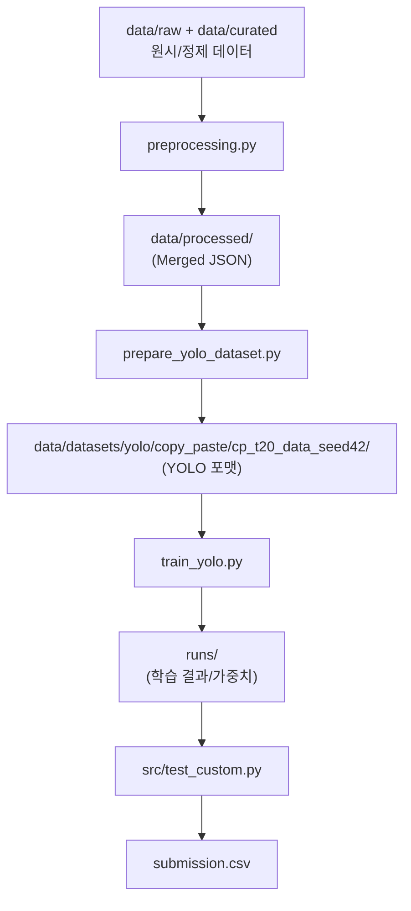

# 💊 PillaTech 알약 탐지 프로젝트 (Team 04)_260330

PillaTech 4팀의 알약 객체 탐지(Object Detection) 프로젝트입니다. 
이 가이드는 **Exp 15 Baseline 2.0**을 바탕으로 실험을 고도화하려는 팀원들을 위한 온보딩 매뉴얼입니다.
배포 버전 기준은 **`v15 = Exp15 Baseline 2.0`** 으로 고정합니다.

> [!IMPORTANT]
> **데이터 무결성 확보**(2026-03-27):
> - 이전의 **Exp 1~10** 실험 데이터셋에는 9건의 어노테이션 오류가 존재했을 수도 있습니다.
> - 팀 협의를 통해 데이터클리닝 오류를 수정한 **Exp 12**를 당시 2차 베이스라인으로 확정했습니다. 

> [!IMPORTANT]
> **재현성 로그 체계강화 및 seed 42 고정**(2026-03-30): 
> - 2.0 베이스라인은 **Exp 15**입니다.
> - 상세 내역은 [experiments.md](./experiments.md)를 참고하세요.

> [!IMPORTANT]
> **Seed 용어 규칙**:
> - `data_seed`: 전처리/분할/오프라인 증강 등 데이터셋 생성 seed
> - `seed`(단독 표기): 학습 실행 seed(`train_seed`)로 간주
---

## 🏗️ 전체 파이프라인 구조 (Project Structure)
실험은 크게 **전처리 → 데이터셋 구축 → 학습/검증 → 추론**의 4단계로 구성됩니다.



## 📂 폴더 구조 (Directory Layout)
팀원 온보딩 기준으로 자주 보는 핵심 경로만 정리했습니다.

### 🔗 주요 경로 (Quick Links)
- **`configs/train/`**: 학습 설정 YAML
- **`configs/inference/`**: 추론 설정 YAML
- **`src/test_custom.py`**: 추론 스크립트 (config/CLI 지원)
- **`runs/exp15_train_baseline_yolo11s_2.0/weights/best.pt`**: v15(Exp15) 구글드라이브 가중치
- **`data/raw/sprint_ai_project1_data/`**: 원본 이미지 데이터 (train/test images)
- **`data/curated/sprint_ai_project1_data/`**: 정제된 어노테이션 데이터 (train_annotations)
- **`data/datasets/yolo/`**: 학습에 직접 사용하는 YOLO 포맷 데이터셋(`copy_paste/`, `clahe/` 계열)
- **`logs/train/`**: 학습 런타임 로그
- **`metrics/train/`**: 학습 성능/메타 리포트 JSON
- **`metrics/infer/`**: 추론 런타임/환경 리포트 JSON
- **`submission/`**: 제출용 CSV 로컬 산출물 (Git 미추적, `.gitignore`)

상세한 실험별 경로, runs 폴더 계보, 재현 커맨드는 `experiments.md`를 참고하세요.
	
```text
PillaTech_team04/
├── README.md                      # 온보딩 매뉴얼
├── experiments.md                 # 실험 로그/인사이트 기록
├── requirements.txt               # 의존성 고정 (팀 환경 재현용)
├── preprocessing.py               # 데이터 정제/병합/합성 파이프라인
├── prepare_yolo_dataset.py        # YOLO 포맷 데이터셋 구축 스크립트
├── train_yolo.py                  # 학습 실행기
├── src/                           # 추론/앙상블/평가 스크립트
│   ├── test_custom.py             # 추론 엔진 (config/CLI 지원)
│   ├── ensemble_wbf.py            # WBF 앙상블
│   ├── eval_csv_map.py            # CSV 로컬 mAP 평가
│   ├── exp8_search.py             # NMS 파라미터 탐색
│   └── utils/                     # 공통 유틸
│       ├── logging_utils.py       # 런타임 로깅 유틸
│       └── metrics_utils.py       # 메트릭/환경 수집 유틸
├── scripts/                       # 실험 파이프라인 실행용 셸 스크립트
│   ├── exp5/
│   ├── exp9/
│   └── exp10/
├── configs/                       # 실험 설정 (Reproducibility 핵심)
│   ├── train/                     # 학습 설정 YAML (exp15_train_*.yaml 등)
│   └── inference/                 # 추론 설정 YAML (exp15_inference_*.yaml 등)
├── data/                          # 데이터 저장소
│   ├── raw/                       # 원본 이미지(불변)
│   │   └── sprint_ai_project1_data/
│   │       ├── test_images/
│   │       ├── train_images/
│   ├── curated/                   # 정제된 COCO JSON (학습 입력용 어노테이션)
│   │   └── sprint_ai_project1_data/
│   │       └── train_annotations/
│   ├── processed/                 # 전처리 산출물 (reports/splits/merged/offline)
│   └── datasets/                  # 학습 입력 물질화 결과
│       └── yolo/
│           ├── copy_paste/
│           └── clahe/
├── logs/                          # 실행 로그
│   └── train/                     # 학습 로그
├── runs/                          # 학습 산출물 (weights/plots/args/results)
│   ├── exp12_train_yolo11s_noflip/      # 과거 베이스라인(이력 보존)
│   ├── exp15_train_baseline_yolo11s_2.0/
│   └── detect/                    # Ultralytics val 산출물
├── metrics/                       # 성능 리포트(JSON)
│   ├── train/                     # 학습 메트릭
│   ├── infer/                     # 추론 런타임 메트릭
│   └── *.json                     # 레거시/호환 파일
├── submission/                    # 제출용 CSV 로컬 산출물 (Git 미추적, .gitignore)
└── weights/                       # (선택) 베이스 모델 파일 보관 (yolo11s.pt 등)
```

### 핵심 파일 역할
- **`preprocessing.py`**: Curated COCO JSON을 이미지별로 병합하고, 계층적 분할(Stratified) 및 합성 증강(Copy-Paste) 수행.
- **`prepare_yolo_dataset.py`**: 병합된 JSON을 YOLO 학습용 디렉토리 구조 및 라벨 파일로 변환.
- **`train_yolo.py`**: `configs/train/` 파일을 읽어 학습을 수행하고 `metrics/`에 결과를 자동 저장.
- **`src/test_custom.py`**: CLI 인자와 `configs/inference/`를 지원하는 범용 추론 스크립트.

> [!NOTE]
> `configs/train/*.yaml`의 `copy_paste`는 **Ultralytics YOLO 내부 증강 옵션**입니다.  
> Exp 5에서 사용한 **커스텀 합성(데이터셋 자체 증량)** 방식과는 별개입니다.  
> 즉, Exp5 방식 적용 여부는 `copy_paste` 값이 아니라, `dataset.yaml`이 참조하는 학습 데이터 폴더에 합성 이미지/라벨이 실제로 포함되어 있는지로 판단합니다.

---

## 🚀 퀵스타트: 환경 구축 및 실행
아래 모든 명령은 프로젝트 **루트 폴더인 `PillaTech_team04/`** 에서 실행하세요.

### 1단계: 가상환경 설정

#### OS별 실행 기준 (Windows / WSL / Mac)
- 리드미 설명 기준은 Linux 계열 실행환경입니다. (WSL2는 Linux로 간주합니다.)
- Windows 네이티브(PowerShell/CMD) 실행은 경로/패키지 차이로 재현성 이슈가 커집니다.

```bash
conda create -n codeit python=3.12 -y
conda activate codeit
pip install -r requirements.txt
```

> [!NOTE]
> `requirements.txt`는 `codeit` 가상환경에서 검증된 모든 패키지 버전을 포함하고 있습니다. 환경 차이로 인한 오류를 방지하기 위해 반드시 위 명령어로 설치를 권장합니다.

### 2단계: 데이터 준비 (공통)
원본/정제 데이터를 아래 구조(Folder Structure)에 맞춰 `data/raw/`, `data/curated/` 폴더에 배치합니다. 

```text
data/raw/sprint_ai_project1_data/
├── test_images/         # 추론용 테스트 이미지 (.png)
└── train_images/        # 학습용 원본 이미지 (.png)

data/curated/sprint_ai_project1_data/
└── train_annotations/   # 정제된 COCO 포맷 JSON (pred/yewon 브랜치 데이터 클렌징 버전)
```

배치 후 다음을 순차적으로 실행하여 **데이터 동기화**를 수행합니다.
```bash
# 1. 960px 해상도, Stratified 분할, Copy-Paste 증강 적용 JSON 생성
python preprocessing.py

# 2. YOLO 데이터셋 구축 (Images & Labels 복사)
python prepare_yolo_dataset.py
```

### 3단계: 가중치 세팅 (공유 가중치 사용 시)
- Exp 15 베이스라인 가중치(Google Drive): https://drive.google.com/drive/folders/1aR9h-X7ZMsv2_x96E2IfMehTS60A5nnc?dmr=1&ec=wgc-drive-%5Bmodule%5D-goto
- 팀원분들은 가중치를 아래 경로에 동일하게 배치해주세요.

```bash
mkdir -p runs/exp15_train_baseline_yolo11s_2.0/weights/
# best.pt를 위 폴더에 저장
```

기준 파일 경로
- `runs/exp15_train_baseline_yolo11s_2.0/weights/best.pt`
- `configs/inference/exp15_inference_baseline_yolo11s_2.0.yaml`의 `model`이 위 경로를 참조합니다.
- `runs/`는 용량 이슈로 일반적으로 Git에 포함하지 않습니다.

### 4단계: 실행 분기 (Exp 15 기준, 가중치 유무)
Exp 15 기준 실행은 `best.pt` 존재 여부로 나눕니다.
1. 가중치가 이미 있으면 (빠른 경로: 추론만 실행)
```bash
python src/test_custom.py --config configs/inference/exp15_inference_baseline_yolo11s_2.0.yaml
```

2. 가중치가 없으면 (재현 경로: 학습 후 추론)
```bash
python train_yolo.py --config configs/train/exp15_train_baseline_yolo11s_2.0.yaml
```
```bash
python src/test_custom.py --config configs/inference/exp15_inference_baseline_yolo11s_2.0.yaml
```

3. 커스텀 데이터셋으로 학습하려면 (`--data`)
```bash
python train_yolo.py --config configs/train/exp15_train_baseline_yolo11s_2.0.yaml --data <path/to/dataset.yaml>
```
```bash
python src/test_custom.py --config configs/inference/exp15_inference_baseline_yolo11s_2.0.yaml
```

### ⚙️ 추론 권장 설정 (Inference Settings)
Exp 15 베이스라인과 동일한 성능을 재현하려면 아래 파라미터를 유지하세요.
- 설정 파일: `configs/inference/exp15_inference_baseline_yolo11s_2.0.yaml`
- 해상도(`imgsz`): `960`
- 임계값: `conf=0.25`, `iou=0.70`
- 실행 명령은 위 `4단계: 실행 분기`를 따릅니다.

---

## 🧭 실험 운영 규칙 (Naming Policy)
아래 3가지를 일치시켜 실험 계보를 명확히 관리하세요.

| 구분 | Exp15 예시 값 |
| --- | --- |
| 파일명(확장자 제외) | `exp15_train_baseline_yolo11s_2.0` |
| YAML 내 `name` | `exp15_train_baseline_yolo11s_2.0` |
| `runs` 폴더명 | `runs/exp15_train_baseline_yolo11s_2.0/` |

---

## 📈 실험 고도화 가이드 (Next Step)
현재 팀의 최고 점수는 오염된 데이터가 유입되었을 수도 있는 **Exp 10 (3-Seed Ensemble / Kaggle: 0.98073)** 입니다. 

1.  **설정 상속**: `configs/train/exp15_train_baseline_yolo11s_2.0.yaml`안의 내용을 복사하여 모델 size(`yolo11m`) 혹은 새로운 아키텍처(RT-DETR 등)로 확장하세요.
2.  **앙상블 전략**: 정제된 Exp 15 가중치를 바탕으로 시드 앙상블 혹은 멀티스케일 추론(`src/ensemble_wbf.py`)을 적용하여 0.99 돌파를 목표로 해봅시다. 

---

## 🛠️ 기타 (Optional)
다음 파일들은 특정 실험 목적(Exp 8, 9 등)을 위해 생성되었으며, Exp 15 기본 학습/추론 파이프라인에는 필수는 아닙니다.

- `src/ensemble_wbf.py`: 여러 결과 CSV를 WBF로 병합
- `src/eval_csv_map.py`: CSV를 로컬 라벨과 비교해 mAP 계산
- `src/exp8_search.py`: validation 기준 NMS(conf/iou) 탐색

### 선택 실행 스크립트 (scripts/)
- `scripts/exp9/run_exp9_val.sh`: Exp9 validation 파이프라인 실행
- `scripts/exp9/run_exp9_test.sh`: Exp9 test 추론 파이프라인 실행
- `scripts/exp10/run_exp10_ensemble_final.sh`: Exp10 앙상블 파이프라인 실행

---

## 🧪 Kaggle 팀 운영 권장 가이드 (Windows 1, WSL2 1, Mac 2 혼합 환경)
각자 로컬에서 추론한 값으로 제출하는 것이 아니라 **“공식 제출 환경(팀 지정 컴퓨터)에서 생성한 CSV를 제출”**하는 것으로 고정해야 점수 드리프트를 막을 수 있습니다.

### 운영 권장 시나리오
- **개발/탐색 트랙**: 각자 OS에서 자유롭게 실험 
- **공식 검증/제출 트랙**: 1대의 공식 컴퓨터에서만 최종 재실행/제출
- **공식 점수 기준**: Kaggle 제출 CSV는 공식 환경 산출물만 인정

### 시간 제약 대응 (현실적인 운영)
- 모든 실험을 1명이 돌리지 않습니다.
- 각자 로컬에서 후보 실험들을 탐색합니다.
- 상위 후보만 공식 환경에서 재학습/재추론합니다. 
- 제출은 공식 환경에서 만든 CSV만 사용합니다. 

### 재현성 체크리스트 (최종 후보 필수)
- `configs/train/*.yaml` (학습 입력값)
- `configs/inference/*.yaml` (추론 입력값)
- `metrics/train/*_metrics.json` (학습 결과/적용값)
- `metrics/infer/*_infer_runtime.json` (추론 실행 환경)
- `runs/.../weights/best.pt` (가중치)
- `submission/*.csv` (제출 파일)

### 주의사항
- 각자 로컬에서 같은 설정으로 다시 추론하면 OS/torch 차이로 CSV가 달라질 수 있습니다. 
- 제출 직전 가중치 경로/파일명이 섞이면 다른 모델이 제출될 수 있습니다.


---
© pill-detection-v2
