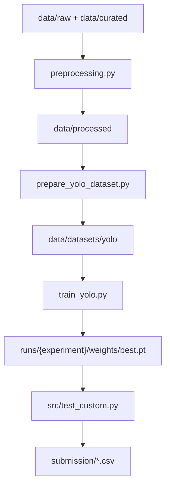

# Pill Detection

알약 이미지에서 최대 4개의 알약 위치와 클래스를 탐지하는 객체 탐지 프로젝트입니다.  
프로젝트에서 제공된 Kaggle 경구약제 이미지 데이터셋을 기준으로 데이터 정제부터 YOLO 학습, 제출 CSV 생성, FastAPI 기반 추론 API 배포까지 end-to-end로 구현합니다.

## 목차

- [프로젝트 개요](#프로젝트-개요)
- [주요 기능](#주요-기능)
- [기술 스택](#기술-스택)
- [폴더 구조](#폴더-구조)
- [데이터 구조](#데이터-구조)
- [환경 설치](#환경-설치)
- [실행 흐름](#실행-흐름)
- [학습](#학습)
- [추론](#추론)
- [평가와 앙상블](#평가와-앙상블)
- [API 서빙과 배포](#api-서빙과-배포)
- [실험 관리](#실험-관리)
- [실험 로그](./experiments_log.md)

## 프로젝트 개요

목표는 사진 속 알약의 bounding box와 class를 안정적으로 예측하는 모델을 만드는 것입니다. Kaggle private competition 형식으로 제출 CSV를 생성하고, mAP 기준으로 성능을 비교합니다.

핵심 문제는 단순 모델 학습이 아닙니다. 제공된 annotation 구조가 객체 단위 JSON에 가깝고, 일부 라벨 오류와 bbox 품질 문제가 있었기 때문에 데이터 정제, 계층적 split, YOLO 포맷 변환, 실험 결과를 일관되게 추적하는 것이 성능만큼 중요합니다.

현재 대표 베이스라인은 `Exp15 Baseline 2.0`입니다.

- 모델: YOLO11s
- 입력 크기: `960`
- seed: `42`
- optimizer: `AdamW`
- 기준 설정: `configs/train/exp15_train_baseline_yolo11s_2.0.yaml`
- 기준 추론 설정: `configs/inference/exp15_inference_baseline_yolo11s_2.0.yaml`

## 주요 기능

- COCO annotation 정제 및 이미지 단위 병합
- stratified split 기반 학습/검증 데이터 구성
- YOLO 데이터셋 자동 생성
- YOLO11 기반 학습, 검증, 추론
- 제출용 CSV 생성
- confidence/IoU 탐색
- Weighted Boxes Fusion 기반 앙상블
- MLflow 기반 실험 추적과 모델 Registry 연동
- FastAPI 기반 모델 추론 API
- Docker, Nginx, Blue-Green 배포 스크립트

## 기술 스택

| 영역 | 스택 |
| --- | --- |
| Language | Python 3.12 |
| Modeling | PyTorch, Ultralytics YOLO |
| Data / Evaluation | NumPy, pandas, OpenCV, scikit-learn |
| Tracking / Registry | MLflow |
| Serving | FastAPI, Uvicorn, Gunicorn |
| Deployment | Docker,  Nginx |


## 폴더 구조

```text
pill_detection/
├── README.md                         # 루트 온보딩 문서
├── requirements-runtime.txt          # API/추론 런타임 의존성
├── requirements-experiment.txt       # 학습/평가/실험 의존성
├── Dockerfile                        # FastAPI 추론 서버 이미지
├── docker-compose.yaml               # Nginx / MLflow 등 로컬 서비스
├── preprocessing.py                  # COCO annotation 정제/병합/전처리
├── prepare_yolo_dataset.py           # YOLO 학습 데이터셋 생성
├── train_yolo.py                     # 학습 실행기
├── configs/
│   ├── train/                        # 학습 설정 YAML
│   └── inference/                    # 추론 설정 YAML
├── data/
│   ├── raw/                          # 원본 이미지/원본 annotation
│   ├── curated/                      # 정제 annotation source of truth
│   ├── processed/                    # 전처리 중간 산출물
│   └── datasets/                     # YOLO 포맷 학습 데이터셋
├── src/
│   ├── api/main.py                   # FastAPI 추론 API
│   ├── test_custom.py                # 제출 CSV 생성용 추론 스크립트
│   ├── eval_csv_map.py               # CSV 기반 로컬 mAP 평가
│   ├── ensemble_wbf.py               # WBF 앙상블
│   ├── exp8_search.py                # NMS threshold 탐색
│   └── utils/                        # 공통 경로/로깅/메트릭 유틸
├── scripts/
│   ├── deploy.sh                     # Blue-Green 배포
│   ├── staging_validate_and_release.sh # 후보 모델 등록 -> staging 헬스체크 -> production 승격/배포 자동화
│   ├── registry_ops.py               # MLflow Registry 등록/승격/롤백 조작
│   └── resolve_registry_model_path.py # MLflow Registry URI를 실제 YOLO .pt 체크포인트 경로로 변환
├── metrics/                          # 학습/검증/추론 메트릭 JSON
├── runs/                             # 학습 결과와 weight
├── submission/                       # Kaggle 제출 CSV
└── deploy/nginx.conf                 # Nginx upstream 설정
```

## 데이터 구조

프로젝트의 데이터 경계는 아래처럼 나눕니다.

| 경로 | 역할 | 원칙 |
| --- | --- | --- |
| `data/raw/` | 원본 이미지와 원본 annotation 보관 | 원본 보존 영역 |
| `data/curated/` | 정제된 annotation | 학습/전처리 annotation source of truth |
| `data/processed/` | 병합 annotation, train/val split, 클래스 이름-숫자 ID 매핑, 데이터 품질 리포트 저장 | 재생성 가능 |
| `data/datasets/` | COCO annotation을 YOLO 학습 형식으로 변환한 이미지/라벨/dataset.yaml 저장 | 재생성 가능 |

제공 데이터는 PNG 이미지와 COCO JSON annotation으로 구성됩니다. `train_images`, `train_annotations`, `test_images`를 기준으로 전처리와 추론 파이프라인을 실행합니다.

주의: 가이드에서 금지한 `경구약제조합 5000종`의 특정 train/test 원천/라벨링 데이터는 Kaggle 데이터 누수로 이어질 수 있으므로 학습에 사용하지 않았습니다. 

## 환경 설치

이 프로젝트는 `pill_detection` conda 환경에서 실행합니다.

```bash
conda activate pill_detection
```


### Requirements 파일 역할

| 파일 | 역할 | 언제 설치하나 |
| --- | --- | --- |
| `requirements-runtime.txt` | FastAPI + YOLO 추론 서버용 최소 런타임 | API 서버 실행, Docker 런타임 이미지 빌드 |
| `requirements-experiment.txt` | 학습, 평가, EDA, 실험 재현용 환경 | 전처리, 학습, 검증, 로컬 평가, 실험 스크립트 실행 |

API 런타임만 필요하면:

```bash
conda run -n pill_detection python -m pip install -r requirements-runtime.txt
```

학습, 평가, 실험 재현까지 필요하면:

```bash
conda run -n pill_detection python -m pip install -r requirements-experiment.txt
```

`requirements-experiment.txt`에는 아래 줄이 들어갑니다.

```txt
-r requirements-runtime.txt
```

이건 `pip`의 표준 requirements 문법입니다. `requirements-experiment.txt`를 설치할 때 `requirements-runtime.txt`도 같이 읽어서 설치하라는 뜻입니다.

정리하면:
- 둘 다 따로 설치할 필요는 없습니다. `requirements-experiment.txt`가 runtime을 포함합니다.

설치 후 검증:

```bash
conda run -n pill_detection python -m pip check
```

설치 전 의존성 충돌 확인:

```bash
conda run -n pill_detection python -m pip install --dry-run -r requirements-experiment.txt
```

## 실행 흐름

전체 파이프라인은 아래 순서입니다.



## 데이터 전처리

- 기본 설정으로 전처리

  ```bash
  conda run -n pill_detection python preprocessing.py
  ```

- 특정 학습 YAML 기준으로 전처리

  ```bash
  conda run -n pill_detection python preprocessing.py \
    --config configs/train/exp15_train_baseline_yolo11s_2.0.yaml
  ```

- YOLO 데이터셋 생성

  ```bash
  conda run -n pill_detection python prepare_yolo_dataset.py \
    --config configs/train/exp15_train_baseline_yolo11s_2.0.yaml
  ```

## 학습

- Exp15 기준 학습

  ```bash
  conda run -n pill_detection python train_yolo.py \
    --config configs/train/exp15_train_baseline_yolo11s_2.0.yaml
  ```

- 커스텀 데이터셋으로 학습

  ```bash
  conda run -n pill_detection python train_yolo.py \
    --config configs/train/exp15_train_baseline_yolo11s_2.0.yaml \
    --data path/to/dataset.yaml
  ```

- 학습 산출물은 기본적으로 `runs/<experiment_name>/` 아래에 생성됩니다. 핵심 파일은 `weights/best.pt`입니다.

## 추론

Exp15 기준 제출 CSV 생성:

```bash
conda run -n pill_detection python src/test_custom.py --config configs/inference/exp15_inference_baseline_yolo11s_2.0.yaml
```

주요 추론 설정:

- model: `runs/exp15_train_baseline_yolo11s_2.0/weights/best.pt`
- imgsz: `960`
- conf: `0.25`
- iou: `0.70`
- output: `submission/exp15_baseline_yolo11s_2.0.csv`

## 평가와 앙상블

기본 학습/추론 흐름에서는 위의 `train_yolo.py`, `src/test_custom.py` 명령을 사용합니다. 반복 실험이나 앙상블처럼 인자가 길어지는 작업은 `scripts/` 아래 실험별 실행 스크립트로 묶어 관리합니다.

- Exp10 3-seed 학습 배치

  ```bash
  bash scripts/exp10/run_exp10_batch.sh
  ```

- Exp10 3-seed WBF 앙상블 및 평가

  ```bash
  bash scripts/exp10/run_exp10_ensemble_final.sh
  ```

- Exp9 multi-scale WBF 검증/제출 파이프라인

  ```bash
  bash scripts/exp9/run_exp9_val.sh
  bash scripts/exp9/run_exp9_test.sh
  ```

- 주의: Exp9/Exp10 스크립트는 과거 실험 재현용입니다. 현재 추론 엔트리포인트인 `src/test_custom.py` 기준으로 정리했지만, 실행 전 가중치 경로와 데이터셋 경로가 로컬 환경에 존재하는지 확인합니다.

- 개별 도구의 전체 인자는 `--help`로 확인합니다.

  ```bash
  conda run -n pill_detection python src/eval_csv_map.py --help
  conda run -n pill_detection python src/exp8_search.py --help
  conda run -n pill_detection python src/ensemble_wbf.py --help
  ```

- 실험별 정량 결과와 판단 근거는 [experiments_log.md](experiments_log.md)를 참고합니다.

## API 서빙과 배포

- FastAPI 앱 엔트리포인트

  ```text
  src/api/main.py
  ```

- 로컬 API 실행

  ```bash
  conda run -n pill_detection gunicorn src.api.main:app \
    -k uvicorn.workers.UvicornWorker \
    --bind 0.0.0.0:8000 \
    --workers 1
  ```

- 헬스체크

  ```bash
  curl http://127.0.0.1:8000/health
  ```

- 이미지 추론

  ```bash
  curl -X POST http://127.0.0.1:8000/predict \
    -F "file=@path/to/image.png"
  ```

- Docker 이미지 빌드

  ```bash
  docker build -t pill-api-image .
  ```

- Blue-Green 배포

  ```bash
  bash scripts/deploy.sh
  ```

  `deploy.sh`는 현재 Nginx upstream의 blue/green 상태를 확인하고, 새 API 컨테이너를 띄운 뒤 `/health` 통과 시 트래픽을 새 컨테이너로 전환합니다.

- API는 기본적으로 `MODEL_URI=models:/pill_detection_2026@production`을 사용합니다. MLflow Registry URI를 런타임에서 직접 해석하려면 `mlflow`가 런타임 의존성에 있어야 합니다.

## 실험 관리

- 실험 추적 기준: MLflow
- 학습 파라미터, 메트릭, artifact 기록
- `best.pt`, config, metrics 파일 보존
- Registry alias 기반 모델 승격
- `@staging` 검증 후 `@production` 승격

- MLflow 서버 실행

  ```bash
  docker compose up -d mlflow
  ```

- Registry 조작

  ```bash
  conda run -n pill_detection python scripts/registry_ops.py --help
  ```

  `registry_ops.py`는 MLflow 모델 버전을 등록하고 `@staging`, `@production` alias를 승격하거나 롤백할 때 사용합니다.

- Staging 검증과 release

  ```bash
  bash scripts/staging_validate_and_release.sh --help
  ```

  `staging_validate_and_release.sh`는 새 MLflow run을 후보 모델로 등록한 뒤 `@staging` 컨테이너를 임시로 띄워 `/health`를 검증합니다. 통과한 모델만 옵션에 따라 `@production`으로 승격하고 배포합니다.

- Registry URI 해석

  `resolve_registry_model_path.py`는 `models:/pill_detection_2026@production` 같은 Registry URI를 실제 YOLO `.pt` 파일 경로로 변환합니다. 컨테이너가 Registry alias가 아니라 확정된 체크포인트 파일을 로드하게 만들기 위한 보조 스크립트입니다.
